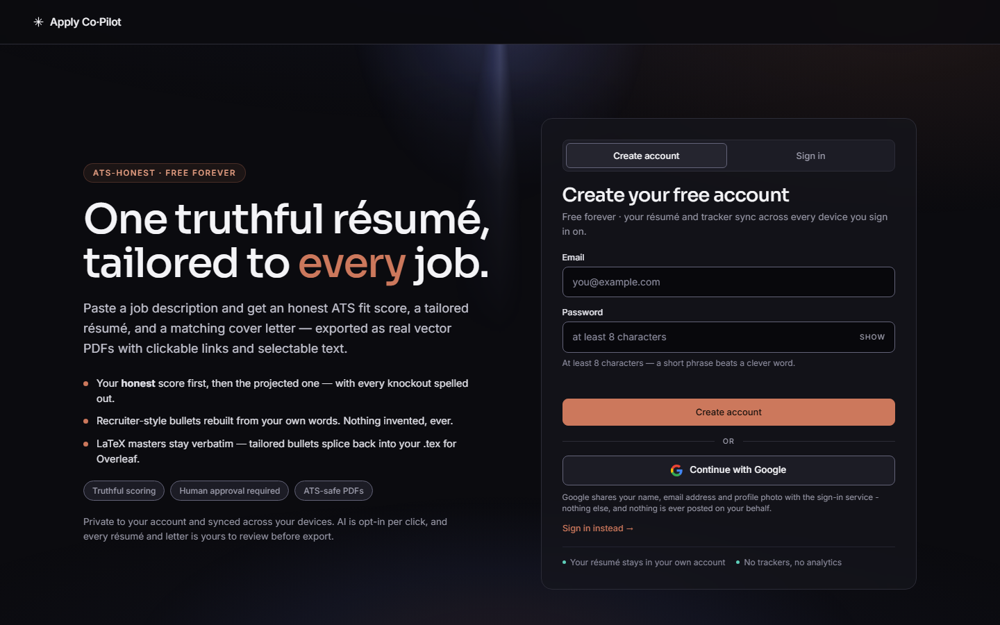

The sign-in gate — the whole app lives behind your own free account.

# 🧭 Apply Co·Pilot

### One truthful résumé, tailored to **every** job.

**Upload your résumé once. Paste any job description. Get an honest ATS fit score, a tailored résumé and a matching cover letter — exported as real vector PDFs with clickable links and selectable text.**

*A deterministic engine you can explain, and an AI layer that is opt-in per click and cannot invent a fact about you. Free, and it stays free.*

`https://prometheus-18.github.io/Apply-copilot/`

*Best in **Chrome** or **Edge**. Works on phones too.*

---

## ⚡ Quick start — about a minute

1. **[Open the app](https://prometheus-18.github.io/Apply-copilot/)** and create a free account — email + password, or **Continue with Google**. No card, no setup.
2. **⓪ Master résumé** → upload a **PDF**, **TXT** or **LaTeX `.tex`** file (or paste the source). You do this *once*; it syncs to every device you sign in on.
3. **◆ Paste the job** → company, role, the whole job description → **▶ Run analysis & tailor**.

You land on **① ATS Score** with your *honest current* number first. Then walk down the page: tailored résumé → cover letter → outreach → tracker.

---

## ✨ What you get

<table>
<tr>
<td width="33%" valign="top">

**🎯 A score you can defend**

Deterministic and fully explainable: keyword coverage, real years-of-experience maths, seniority distance, structure and placement — plus knockouts that genuinely crush unrealistic applications. Same résumé + same job = same number, every time.

</td>
<td width="33%" valign="top">

**🔎 Honest gaps, named**

If the job asks for **Tableau** and your résumé only says "dashboards", the gap is reported as *Tableau* — not silently absorbed by a generic keyword. Each miss is its own line with its own **＋ Add** button, so nothing is added unless you say it is true.

</td>
<td width="33%" valign="top">

**📄 A real vector PDF**

Built programmatically, never rasterised and never through a print dialog: selectable text, clickable email / phone / LinkedIn / GitHub links, no watermark. Exactly what an ATS parses.

</td>
</tr>
<tr>
<td valign="top">

**📝 Recruiter-style bullets**

Paragraph-shaped experience becomes short, verb-first, quantified-first pointers — by **splitting and reordering your own words**, never by writing new ones. Where a bullet already states a result, the result leads.

</td>
<td valign="top">

**🧾 Your summary, in your words**

The tailored summary is built from your real latest title, your tenure to one decimal, never inflated to "N+ years" and sentences from your own master — not from dictionary labels or filler.

</td>
<td valign="top">

**✉️ A letter that keeps up**

The cover letter is generated deterministically and stays **live-synced**: accept a keyword, apply an AI rewrite or edit your summary and the letter re-derives itself to match.

</td>
</tr>
<tr>
<td valign="top">

**🔍 What an ATS sees**

Toggle your master between raw text and the **parse result** — every field and section an ATS-style reader recovered, with `✗ not found` marked in the open. Fix your master before you ever blame the score.

</td>
<td valign="top">

**⌘ LaTeX / Overleaf workflow**

A `.tex` master is kept **byte-verbatim**. Tailored bullets and the summary splice back into your own file — `\item` count and order untouched — then **⬇ Tailored .tex**, **Copy LaTeX** or **↗ Open in Overleaf**.

</td>
<td valign="top">

**🔬 Three-lens AI audit**

One pass, three reviewers: ATS auditor, six-second recruiter, hiring manager. Scores, missing hiring signals (each marked *supported by your master* or not) and per-bullet fixes. **Critique only — it never rewrites anything.**

</td>
</tr>
</table>

---

## 🚶 The walkthrough

> The app is one page you scroll. Each numbered section is a step.

### 0️⃣ &nbsp;Your account
Email + password (live strength meter, show/hide, **Forgot your password?** with a proper recovery flow, and a client-side lockout after repeated failures) — or **Continue with Google**. Your master résumé and job tracker follow you to every device; the database itself refuses to hand your row to anyone else (row-level security). Signing out wipes every local key, including any AI key you saved.

### ⓪ &nbsp;Master résumé — upload once
**PDF · TXT · LaTeX `.tex`**, or paste the source. Single-column, two-column, LaTeX/Overleaf, academic CVs with publications, table templates, icon fonts, multi-page — the parser is regression-tested against 20 fixture layouts drawn from the popular template families. It keeps experience, projects, skills, education, certifications, achievements, publications and languages, and it shows you exactly what it recovered via **🔍 What an ATS sees**.

### ◆ &nbsp;Paste the job
Company, role title, optional job URL, and the **entire** job description. Then **▶ Run analysis & tailor**.

### 1️⃣ &nbsp;ATS Score — the honest number first
Two cards: **Original** (your current résumé, untouched) and **Projected** (after tailoring). Underneath: the score breakdown, every knockout spelled out in plain words, matched keywords, missing-but-required keywords, and preferred/nice-to-have. Then **// Tips to raise your score** — each missing keyword on its own line with its own **＋ Add** button. Add one *only if you genuinely have that skill*; the projected score updates live. **The app never adds anything for you.**

### 2️⃣ &nbsp;Custom résumé
Your résumé rebuilt for this job: sharper summary, most JD-relevant bullets and projects first, skills groups re-ranked by what this job actually names, JD-matched terms and your numbers bolded **in the PDF only**.

② résumé controls (the ✦ and 🔬 actions need the AI proxy deployed; everything else is local and always works):

| Control | What it really does |
|---|---|
| **Fit** | `keep everything (1–1.5 pg)` (default) · `condense to 1 page` · `2 pages, full size`. A ribbon under the toolbar names **exactly** what a fit setting trims — and stays silent when nothing is lost. |
| **↺ Original** | Restores the résumé exactly as generated, discarding AI rewrites and manual edits. |
| **✦ Improve (quick)** | AI pass over your first ~12 bullets + the summary, with a self-critique pass. Your master is not uploaded. |
| **✦ Tailor to JD** | One AI pass over the whole résumé, grounded in your master, aimed at this JD. |
| **🔬 Audit** | The three-lens review. Critique only. |
| **⇆ vs master** | Puts your parsed master side by side with the generated résumé, so you can see precisely what changed. |
| **✎ Edit** | Everything becomes editable in place. While editing, click any line for the **✦ AI edit** popup. |
| **⬇ Download PDF** | The real vector PDF. |
| **⌘ LaTeX Studio** | *(a panel under the toolbar, shown only for `.tex` masters)* For `.tex` masters: edit the spliced LaTeX side by side with the preview, rewrite one `\item` with AI, then download, copy, or open it straight in Overleaf. |

### 3️⃣ &nbsp;Cover letter
Deterministic by default — headline, greeting, evidence drawn from your own summary, a project, a why-*this*-company paragraph built only from skills you actually have, and a close. **✦ AI letter** rewrites it into a five-part structure using only your facts. It follows the résumé live, and it's editable and exportable as its own PDF.

### 4️⃣5️⃣6️⃣ &nbsp;Outreach · Tracker · Find jobs
- **④ LinkedIn Outreach** — current-employee team search via the company People tab, hiring-manager and recruiter searches narrowed to your own cities, an optional verified-contacts lookup, and a connection note that always fits LinkedIn's 300-character limit (live counter).
- **⑤ Job Tracker** — every application with a stage and a next step, synced to your account, exportable to CSV or straight into Sheets (spreadsheet formula injection is neutralised on the way out — a hostile job posting cannot smuggle a formula into your export).
- **⑥ Find Jobs** — one-click LinkedIn / Indeed / Naukri searches for the next one.

**Sign in → ⓪ Master → ◆ Job → ① Score → ＋ Tips → ② Résumé → ⬇ PDF → ③ Letter → ④ Outreach → ⑤ Tracker**

---

## 📐 How the score works (no magic, no floor)

The score is computed in your browser from a weighted arrangement, then multiplied by knockouts. Nothing is random; nothing is an AI opinion.

| Component | Weight | What it measures |
|---|:--:|---|
| Keyword coverage | **50%** | Required skills matched (80% of this) + preferred skills matched (20%) |
| Seniority fit | **30%** | The *worse* of your years-vs-required-years ratio and your title-rank distance |
| Structure | **10%** | Whether the résumé actually has the sections a parser expects — skills, experience, education/summary |
| Placement | **10%** | How many of your matched skills also appear near the top, in the summary and skills block, where a screener looks first |

Then the honest part — **multiplicative knockouts**:

- fewer than **half** the required years → **×0.40**
- **three or more** seniority levels below the role → **×0.45**
- under **34%** of required skills present → **×0.6**

Results are clamped to **2–99**. There is deliberately **no floor** that flatters a hopeless application, and no second "semantic match" number to blur the first one. A one-year résumé against a VP role scores low, and the app tells you why.

Skills are matched on **word boundaries** against a keyword bank of concepts, with named products attached to their concept: if the JD names Tableau, Power BI, dbt, Airflow, Spark, Salesforce, BigQuery and friends, the verdict for that concept is judged on the **product the JD named**. Refining a requirement can only ever turn a *have* into a *gap* — this pass can never inflate a score.

---

## ✦ The AI layer — additive, opt-in, and fenced in

The deterministic engine is the product; AI is a per-click extra, and everything still works with AI switched off or unavailable.

**Where it lives:** in **✎ Edit** mode, click a summary line, a bullet or a cover-letter paragraph and a small **✦** popup appears — tone presets (professional · balanced · conversational · bold), a box for your own instruction, word-length targets and a Humanize pass. Batch passes live in the toolbars: **✦ Improve (quick)**, **✦ Tailor to JD**, **🔬 Audit**, **✦ AI letter**.

**Guards, all enforced in code — the model is never trusted:**

- A rewrite must carry **exactly your original numbers**: none invented, none dropped, or it is discarded. Checked twice — on the server and again in the browser.
- The summary may only use digits that appear in your own text, and may never claim "N+ years" or open with the job's title unless it is genuinely your title.
- **AI-sounding prose is filtered deterministically** (em-dashes, cliché phrasing), unless the word was already yours.
- Keyword-stuffed tails ("…, applying data analysis, data storytelling and customer analytics techniques") are rejected outright.
- **Facts are locked:** titles, employers, dates, education, your skills list and your signature never get an AI button at all.
- Nothing lands until you click apply; **Undo** is one click; **↺ Original** is always there.
- **🔬 Audit** marks every "missing signal" as supported by your master or not — and if it is not, it says so instead of inventing it.

**Keys and limits.** The shared built-in AI is free and capped at **20 actions per day per account**. Prefer your own key? **⚙ AI** takes a free key from **Google Gemini, GitHub Models, OpenRouter, Cerebras, Mistral or Groq** (or a paid OpenAI one), raises your ceiling, and has a **Test key** button that tells you whether the key is valid and which model it will actually use. Your key is stored on that device only, never synced, wiped on sign-out, and self-capped so a runaway loop can't bill you.

---

## 🔒 Privacy & data

- **The scoring, tailoring, recruiter-style bullet normalisation (splitting and reordering your own words), PDF building and LaTeX splicing are 100% local** — pure client-side JavaScript in your tab.
- Your master résumé and tracker live in **your own row** in a Postgres database with row-level security, so only your login can read them.
- Text leaves the browser only for two things: syncing to your own row, and an AI action you clicked. Nothing is stored for training by this project.
- **No analytics, no telemetry, no tracking pixels, no third-party beacons** — grep the file.
- Signing out wipes all local data (master, tracker, job draft, saved AI key, session token) and reloads.
- All five library `<script>` tags are pinned with **Subresource Integrity** hashes and an exact version; an unexpected or tampered file simply refuses to load, and the deterministic engine carries on without it.

---

## 🧩 Chrome side-panel extension

The same app, docked beside the job posting you're reading: an **MV3 side panel** built from the same single source file, requesting **`["sidePanel"]` and nothing else** — no content scripts, no host permissions, no page reading. You paste the JD, exactly as on the web. It signs into the same account (Google sign-in needs a full browser tab, so the panel uses email + password and says so).

It is currently run **unpacked**, and the build tooling isn't part of this slim repo — [open an issue](https://github.com/prometheus-18/Apply-copilot/issues) if you want it.

---

## ❓ FAQ

<b>Is my data private?</b>

Your master résumé and tracker sit in your own row, protected by row-level security — only your login can read them. When you click a ✦ AI action, that text plus the job description go to the AI provider for that one request. Every AI feature is opt-in per click, never automatic, and the résumé generation itself never leaves your browser.

<b>Will the AI make things up on my résumé?</b>

It can only rephrase what you wrote. Every suggestion passes a number-preservation check (your metrics verbatim, or it's discarded), a slop filter, and your explicit approval. Titles, employers, dates, education, skills and your signature are fenced off from AI entirely. The 🔬 Audit deliberately *critiques* rather than rewrites, and flags any missing signal that your master does not support with "never invent it".

<b>Is the PDF one page?</b>

Your choice. **Fit: keep everything** (the default) applies no page-fit trimming and flows to about 1–1.5 pages; **condense to 1 page** shrinks type and trims the least job-relevant bullets; **2 pages, full size** keeps everything at full size. Whichever you pick, a ribbon above the preview names exactly what the PDF is leaving out — and says nothing when nothing is left out.

<b>Is there a limit on AI use?</b>

The shared built-in AI allows 20 actions per day per account, which keeps it free for everyone. Add your own free provider key in **⚙ AI** for a much wider ceiling. Everything else — scoring, tailoring, recruiter-style bullet normalisation, PDFs, LaTeX export, tracking — is unlimited, because it runs on your machine.

<b>My résumé parsed a little wrong.</b>

Some PDFs extract oddly. Open **🔍 What an ATS sees** to find out precisely what was recovered, then either fix it inline with **✎ Edit**, or paste your résumé as text (or LaTeX source) in ⓪ Master for the cleanest possible parse. Found a template that parses badly? Open an issue describing the *layout* — never your personal data. The test suite grows from real cases.

<b>I write my résumé in LaTeX. Do I have to give that up?</b>

No — that workflow is a first-class citizen. Your `.tex` stays byte-verbatim; the tailored summary and changed bullets splice back into your own file without touching `\item` counts, order or any byte outside the replaced spans. Then edit it in **⌘ LaTeX Studio** side by side with the preview, rewrite a single `\item` with AI if you want, and download it or push it straight to Overleaf.

<b>Why does my score sometimes go down after an update?</b>

Because a gap became visible. The engine keeps getting stricter about honesty: for example, a job demanding *Tableau* used to be satisfied by the word "dashboards". Now it isn't, so the miss shows up and the number corrects downward. A number that flatters you doesn't get you the interview.

---

## 🛠 Tech

One HTML file. Vanilla JS. No framework, no bundler, no build step, hosted free on **GitHub Pages**.

- **Engine (local):** résumé parser → JD keyword/seniority scoring → deterministic tailoring, recruiter-style bullet normalisation, cover-letter generation, LaTeX splicing, PDF document definitions.
- **PDF:** [pdfmake](https://pdfmake.github.io/) — vector output, real link annotations, never `window.print()`, never a canvas rasteriser. **Import:** [pdf.js](https://mozilla.github.io/pdf.js/). **Scroll:** [Lenis](https://lenis.darkroom.engineering/). All pinned with SRI.
- **Auth & sync:** [Supabase](https://supabase.com) — email/password + Google OAuth, Postgres with row-level security, per-field dirty-flag sync.
- **AI proxy:** a Supabase Edge Function. The provider keys live server-side only, callers must be signed-in users, quota is enforced per account, and every response is scrubbed for invented digits and slop before it reaches you. It tries a chain of providers so one outage doesn't take the feature down, and your own key (if you saved one) always wins.
- **Look:** a near-black `#0b0b0f` canvas, coral `#cc785c` accent, a pure-CSS volumetric hero light beam (no JS, no WebGL, and it stands still if you asked for reduced motion), Sora · Inter · IBM Plex Mono.
- **Gates:** **584 assertions across five suites** — full-pipeline engine, link survival, extension static/CSP lockdown and a headless-browser MV3 smoke test — plus 20 parser fixtures held to a content-retention floor. All green as published.

**Run your own copy:** fork it, create a free Supabase project (auth + `profiles` and `ai_usage` tables + an `ai` Edge Function holding your own provider key as a server-side secret), drop your project URL and *publishable* key into the account `<script>` block, enable GitHub Pages. This repo intentionally ships only `index.html`, `README.md`, `LICENSE`, `thumbnail.png` and `.gitignore` — [open an issue](https://github.com/prometheus-18/Apply-copilot/issues) if you want the Edge Function source.

## 🤝 Contributing

Single file — genuinely easy to hack on. Issues and PRs welcome. Great first contributions: a résumé layout that parses badly (describe the *layout*, never post your personal data), more job boards and locales, more keyword-bank coverage for non-analytics roles.

## 💗 Support

Apply Co·Pilot is free and always will be. If it helped you land an interview, there's a UPI QR in the app's **♥ Support** section.

## ⚖️ Responsible use

Outreach is for **manual, personalised** sending — open a link, write to a real person, send it yourself. Don't mass-automate. AI suggestions are suggestions: you are responsible for every claim on your résumé.

## 📄 License

MIT — see [LICENSE](LICENSE). Made with ♥ by [@prometheus-18](https://github.com/prometheus-18).
